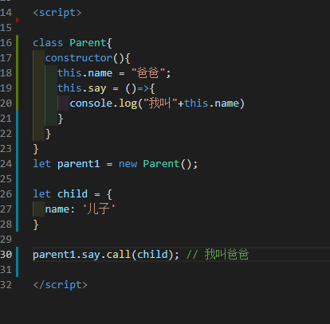
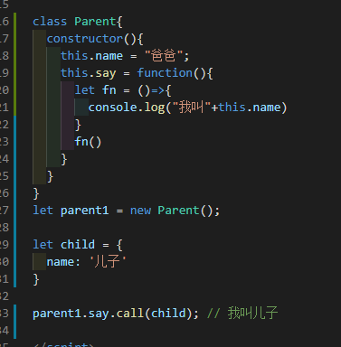
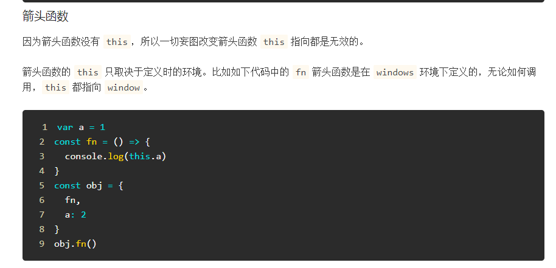

写这篇文章是源于 技术群里的讨论

A:有个朋友刚面，喊实现class。然后他和面试官争论箭头函数的this，一个说定义时，一个说执行时

B:天王老子来了也是定义时

C:天王老子来了也是定义时+1

w:我也认为是定义时 （附和声小声bb）

然后又有人提问说

Z:可能面试官考虑到this被修改的情况

B:箭头函数不能改this指向

w:改底层(滑稽)

Z:es2021没你我不学@W

于是我上图了  证明结果  是的 没错改不动 但是我就想 那既然改不动儿子 那就改爸爸 ， 毕竟儿子跟着爸爸走 ~！！

好家伙 跟着他爸爸走了~~

实际上看下箭头函数的定义我们就知道了

箭头函数与他第一个不为箭头函数的父类this强相关，父类的this运行时才能确定，父类运行的时候，父类运行，确定了this，并且也定义了箭头函数。

所以 你们听懂了吗